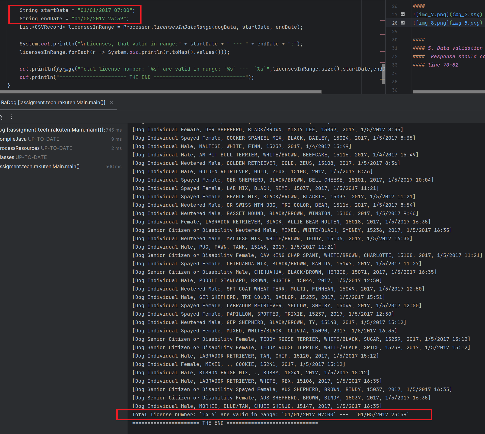

# Done for task `QA Programming with beg Data set test: Task 1`
## Work with large csv file (2017.csv) that lists dogs licensed during 2017. The data is split into the following 7 sections:
### LicenseType, Breed, Color, DogName, OwnerZip, ExpYear, ValidDate
##

###
## 0.1 Read the .csv file.

###
## 1.1: extract the Breeds provided. Normalize the breed names by removing all whitespaces and making them all lowercase. Lastly create a list of unique breeds without duplicates:
#### 

## 1.2 Create a list of number of licenses by LicenseType of each unique breed.
#### 

####
### 1.3 Find out the top 5 popular name of dogs and create a list of these names along with count of dogs having these names.
#### 

####
### Bonus task: Create a method which takes date range as input and return the details of licences issues during that date.
#### for whole year:

#### For 5 days:

### Thanks for interesting task!
